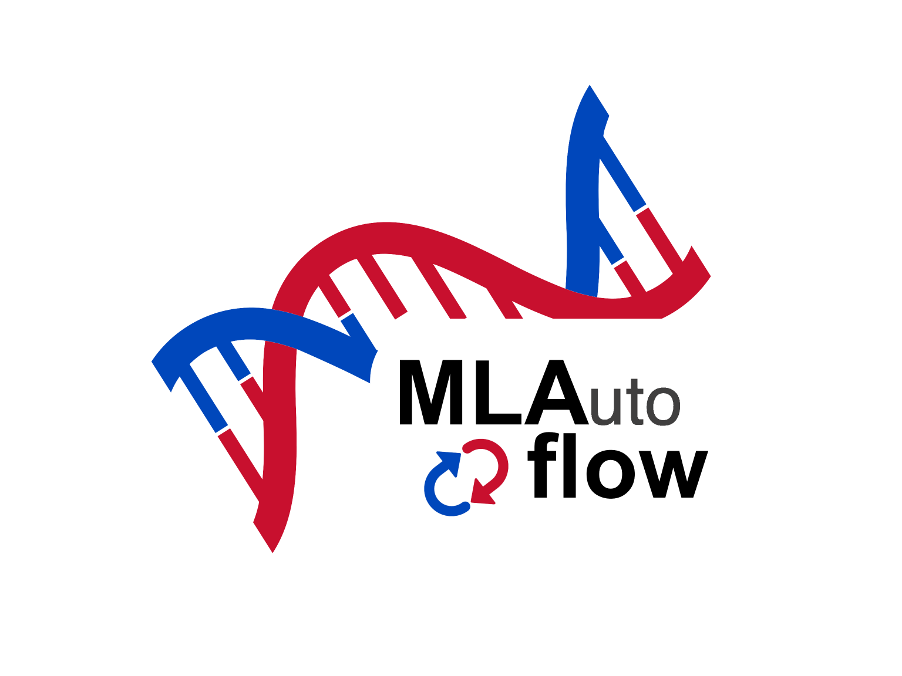

# MLAutoFlow



## 项目简介

**MLAutoFlow** 是一个基于机器学习的自动化单细胞RNA测序分析工具，专注于高效执行数据预处理、降维、聚类与可视化任务。该工具集成了多种自动调参策略，如贝叶斯优化与 CMA-ES，提升分析流程的智能化与鲁棒性。

---

## 🔧 功能模块

1. **自动化数据预处理**  
   - 质控（Quality Control）  
   - 归一化（Normalization）  
   - 对数转换（Log1p）  
   - 高变基因筛选（Highly Variable Genes）

2. **PCA 降维（自动调参）**  
   - 使用贝叶斯优化思想（TPE）  
   - 引入 CMA-ES 自适应调整主成分数 `n_pcs`

3. **邻近图构建与 Leiden 聚类**  
   - 自动调节 `resolution` 参数  
   - 高效构建细胞间图结构

4. **UMAP 可视化 + 聚类质量评价**  
   - 聚类结果可视化  
   - 采用 silhouette score 评价聚类质量

5. **全流程参数优化（Optuna）**  
   - 基于 TPE 策略搜索最优参数组合  
   - CMA-ES 专用于 PCA 降维调优

---

## ⚙️ 技术说明

- 预处理流程被固定，仅调优降维、聚类与可视化参数，避免重复计算；
- 使用浅拷贝与显式内存管理，提升内存效率；
- 支持 AnnData 的 `backed` 模式加载大数据集，适应内存受限场景；
- 支持并行调参，并限制最大线程数避免资源占用过高。

---

## 📦 安装依赖

请确保使用 Python 3.8+ 环境，并运行以下命令安装依赖：

```bash
pip install scanpy optuna cma umap-learn
